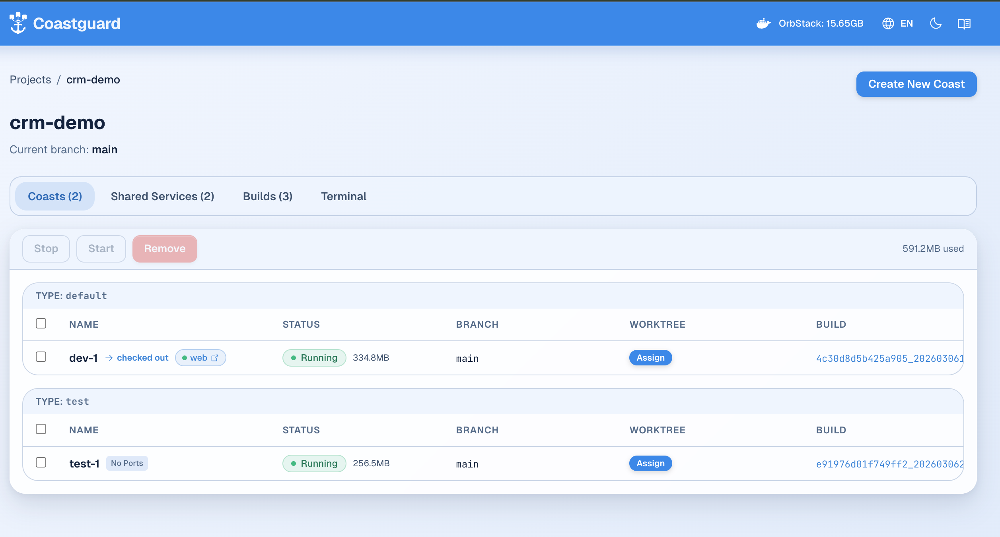

# CRM Demo — Getting Started with Coasts

This guide walks through running the CRM demo project with [Coasts](https://github.com/coast-guard/coasts), creating worktrees for feature branches, and switching between them.

## Prerequisites

- [Coast CLI](https://github.com/coast-guard/coasts) installed
- Docker Desktop or OrbStack running

## 1. Build and Launch

From the project root:

```bash
coast build
coast run dev-1
coast checkout dev-1
```

This builds the project image, creates an instance called `dev-1`, and checks it out
so canonical ports are forwarded to your machine:

- **Frontend:** http://localhost:3000
- **Backend API:** http://localhost:4000/api/health

Open the Coastguard dashboard to see your running instances:

```bash
coast ui
```



## 2. Create a Feature Branch with a Worktree

To work on a feature branch without affecting `dev-1`'s main branch, use `coast assign`
to point the instance at a new worktree. Coast creates the git worktree automatically:

```bash
coast assign dev-1 --worktree feature/my-feature
```

This:
1. Creates a git worktree at `.worktrees/feature/my-feature`
2. Swaps the Coast's filesystem mount to the new worktree
3. Applies the assign strategy for each service:
   - **backend** (`hot`) — filesystem swapped, dev server picks up changes via the mount
   - **web** (`hot`) — filesystem swapped, Next.js hot reload picks up changes

Your editor should open files from `.worktrees/feature/my-feature/` to work on the
feature branch. Edits there are instantly visible inside the Coast.

## 3. Switch Back to Main

To return `dev-1` to the main branch:

```bash
coast unassign dev-1
```

The Coast switches back to the project root (main branch). The worktree stays on
disk — you can reassign to it later.

## 4. Run Multiple Instances

You can run multiple instances simultaneously, each on a different branch:

```bash
coast run dev-2
coast assign dev-2 --worktree feature/another-feature
```

Only one instance can be checked out at a time (owning canonical ports like 3000, 4000).
Switch checkout instantly:

```bash
coast checkout dev-2
```

Every instance always has its own dynamic ports regardless of checkout. Find them with:

```bash
coast lookup --json
```

```
SERVICE    CANONICAL  DYNAMIC
web        3000       62217    (dev-1, accessible even when not checked out)
backend    4000       63889
```

## 5. Run Integration Tests

For isolated testing, use the `Coastfile.test` variant. This runs postgres and redis
inside the DinD container (not shared) with isolated volumes:

```bash
coast build --type test
coast run test-1 --type test
```

Test instances don't auto-start services. Start them and run tests:

```bash
coast exec test-1 -- docker compose up -d
coast exec test-1 -- sh -c "cd test && npx tsx integration.test.ts"
```

Clean up when done:

```bash
coast rm test-1
```

The isolated database volumes are deleted with the instance.

## 6. Useful Commands

```bash
coast ls                              # list all instances
coast lookup                          # find instances for current directory
coast ps dev-1                        # check service status
coast logs dev-1 --service backend    # read backend logs
coast logs dev-1 --service web        # read frontend logs
coast exec dev-1 -- <command>         # run a command inside the Coast
coast doctor                          # diagnose and fix orphaned state
coast ui                              # open the Coastguard web dashboard
```

## Project Layout

```
coasts-demo/
  Coastfile           Default config — shared postgres/redis, all services
  Coastfile.test      Test config — isolated databases, no frontend, no auto-start
  backend/            Elixir/Phoenix API
  frontend/           Next.js app
  test/               Integration tests (TypeScript)
  docker-compose.yml  Service definitions
```
